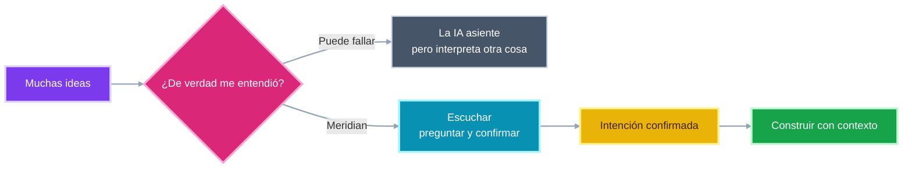
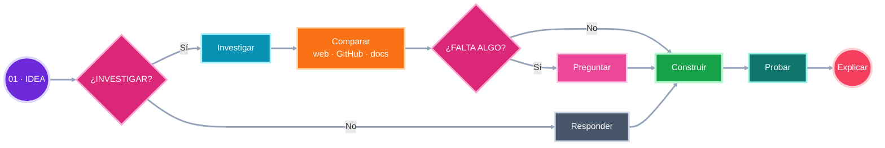

# Meridian

> The operating system for AI agents.

Estoy construyendo Meridian porque creo que los agentes de IA todavía están demasiado encerrados en una conversación. Pueden responder, pero muchas veces no tienen contexto suficiente, no saben qué permisos tienen y no cuentan con un espacio real donde organizar el trabajo.

Meridian nace para cambiar eso. La idea es crear un sistema donde las personas puedan trabajar junto a agentes que entienden el contexto, usan herramientas, respetan límites y convierten una intención en una acción que se puede revisar.

No quiero construir otro chatbot. Quiero construir una base para la próxima generación de software: páginas, proyectos, conocimiento, automatizaciones y agentes trabajando en el mismo lugar.

Hay otra parte del problema que para mí es todavía más humana. Muchas personas tienen una idea grande, pero les cuesta explicarla. A veces da miedo contarla porque la IA responde rápido, dice que entendió y empieza a construir algo que en realidad no era lo que queríamos.

Meridian no debería fingir que entendió. Primero debe devolver lo que cree haber entendido, hacer preguntas cuando algo esté abierto y esperar confirmación antes de convertir una idea sensible en una solución.

## La IA está cómoda y eso es un problema

Llevo tiempo pensando en algo que veo cada vez más: la IA puede escribir código con mucha velocidad, pero demasiadas veces empieza a construir antes de entender realmente el problema.

Le pedimos una landing page y entrega una landing page promedio. Le pedimos una aplicación y propone una arquitectura basada en los patrones que recuerda. Le pedimos una automatización y conecta dos servicios sin detenerse a preguntar qué debería pasar si algo falla. El resultado puede compilar y aun así sentirse vacío, genérico o poco pensado para las personas que lo van a usar.

El problema no es que la IA no sepa programar. El problema es que se está volviendo demasiado cómoda. No investiga lo suficiente, no hace las preguntas importantes y muchas veces no revisa qué soluciones existen ahora mismo en la web, en GitHub o en la documentación oficial.

El vibe coding es impresionante porque nos permite pasar de una idea a un prototipo en muy poco tiempo. Pero también puede crear un bucle de soluciones promedio: pedimos algo, la IA genera una versión que parece correcta y terminamos aceptando una interfaz que se parece a miles de interfaces más.

Yo no quiero una IA que solamente repita lo que ya aprendió. Quiero una compañera de desarrollo que sepa hacer una pausa, entender qué intentamos conseguir, investigar las opciones disponibles y preguntarnos qué dirección tiene más sentido antes de comenzar a escribir archivos.

## La idea que quiero construir con Meridian

Meridian es el lugar donde quiero explorar esa idea. Un agente debería poder entender la petición, decidir si necesita información actual, investigar en paralelo en la web, en documentación y en GitHub, comparar fuentes, descartar soluciones débiles o abandonadas y explicar sus decisiones antes de construir.

No todas las preguntas necesitan una investigación larga. Para algo sencillo, el agente debe responder directamente. Pero cuando hablamos de diseño, código, librerías, arquitectura, seguridad, integraciones o decisiones que pueden afectar el producto, investigar debería ser una capacidad interna y no una instrucción que el usuario tenga que repetir cada vez.

El flujo que imagino es sencillo: recibir la petición, decidir qué necesita verificar, investigar cuando sea necesario, validar lo encontrado, construir una solución, probarla y explicar por qué tomó esas decisiones. La investigación no debería convertirse en una pausa eterna; las fuentes deberían revisarse al mismo tiempo y resumirse solo en lo necesario para actuar.

Eso es lo que quiero mejorar en Meridian. No quedarme criticando que la IA produce cosas genéricas, sino construir agentes que hagan mejores preguntas, busquen referencias actuales, revisen repositorios mantenidos, entiendan la documentación y trabajen con el usuario antes de tomar decisiones importantes.

Este es el flujo que quiero que Meridian haga natural. No se trata de investigar todo siempre. Se trata de saber cuándo hace falta investigar y hacerlo rápido, con varias fuentes al mismo tiempo, antes de inventar una solución.

## Cómo se conectan las piezas

La investigación es solo una parte. Para que un agente pueda trabajar de verdad necesita estar conectado a un espacio, tener contexto, usar herramientas con permisos claros y saber cuándo debe pedir aprobación.

La idea es que el agente no sea una caja que recibe una orden y escupe código. Debe trabajar dentro de un sistema: la persona aporta intención, el workspace conserva el contexto, la memoria guarda las decisiones, las herramientas conectan web/GitHub/MCP y los permisos determinan qué puede hacer. Meridian une esas piezas y deja un resultado que se puede construir, probar y revisar.

Si vamos a llevar esto lejos, Silicon Valley está en la mira. Pero para llegar ahí no basta con generar código en segundos. Necesitamos agentes que entiendan el contexto, que sepan cuándo investigar y que nos ayuden a crear productos con intención.

## Por qué Meridian

Un agente útil necesita más que un buen modelo. Necesita memoria, estructura, permisos, herramientas y una forma clara de saber cuándo debe pedir aprobación.

Por eso Meridian está pensado como un operating system para agentes. El usuario mantiene el control, pero no tiene que repetir el contexto cada vez que quiere hacer algo. El trabajo queda organizado y el agente puede participar de una manera más natural.

La visión es sencilla:

- un espacio de trabajo donde todo tenga contexto;
- agentes con capacidades definidas y límites claros;
- conexiones con las herramientas que ya usamos;
- acciones que puedan auditarse y revisarse;
- una comunidad que ayude a definir cómo debería funcionar este nuevo tipo de software.

## Qué hay aquí

Este repositorio es la parte pública de Meridian. Aquí voy a compartir la visión, decisiones de arquitectura, documentación, ideas, experimentos y formas de colaborar.

El motor privado de Meridian vive separado. No voy a publicar código propietario, credenciales, configuraciones de producción, datos de usuarios ni archivos internos. La comunidad puede ayudar a construir el lenguaje, los estándares y los experimentos públicos sin necesitar acceso al producto privado.

## Cómo está pensado el sistema

Meridian se apoya en varias piezas que ya forman parte del stack moderno de aplicaciones con agentes:

- **Supabase** para autenticación, Postgres, almacenamiento y servicios en tiempo real.
- **Prisma** para mantener los modelos y el acceso a datos tipados.
- **MCP** para conectar agentes con herramientas de forma estructurada y con permisos definidos.
- **TypeScript** para compartir contratos claros entre la aplicación, las capacidades y las integraciones.
- **Next.js** para las superficies de producto y los límites del servidor.
- **GitHub y Vercel** para colaborar, revisar cambios y publicar la documentación.

La tecnología importa, pero el problema que quiero resolver importa más: cómo hacer que los agentes sean realmente útiles cuando tienen que trabajar con personas, información y sistemas reales.

## Roadmap 2026

Durante 2026 quiero concentrarme en cuatro cosas:

1. Explicar con claridad el modelo de Meridian y publicar una arquitectura que la comunidad pueda discutir.
2. Definir cómo se describen las capacidades de un agente, qué permisos necesita y cuándo una acción requiere aprobación humana.
3. Crear patrones de integración con MCP que sean fáciles de entender, probar y adaptar.
4. Formar una comunidad de desarrolladores que pueda experimentar, proponer ideas y ayudar a llevar Meridian a un nivel que pueda llamar la atención en Silicon Valley.

Este roadmap puede cambiar. Prefiero avanzar con fundamentos sólidos y demostraciones útiles antes que llenar el proyecto de funcionalidades que no resuelven un problema real.

## Cómo puedes ayudar

No necesitas acceso al motor privado para empezar. Si te interesa la idea, puedes abrir una Discussion con un caso de uso, proponer una mejora para la documentación, compartir un patrón de MCP, ayudar a definir una capacidad de agente o mejorar la experiencia de quienes llegan por primera vez.

Si encuentras un problema concreto en este repositorio, abre un Issue. Las tareas marcadas como `good first issue` están pensadas para comenzar sin conocer todo el proyecto. Las que tienen `help wanted` son ideas donde me gustaría recibir ayuda de otros desarrolladores.

Antes de enviar un pull request, revisa `CONTRIBUTING.md`. Las propuestas deben ser públicas, autocontenidas y fáciles de entender sin acceder al motor privado.

## Zero-Code Exposure

Esta regla es importante para Meridian: el repositorio público no es una copia incompleta de la aplicación privada.

No publiques API keys, tokens, passwords, archivos `.env`, dumps de bases de datos, datos de usuarios, URLs internas, logs de producción, configuraciones privadas ni código del motor. Tampoco intentes reconstruir o inferir partes privadas de la aplicación a partir de su comportamiento.

Si encuentras un problema de seguridad, no lo publiques en un Issue. Revisa `SECURITY.md` y contacta de forma privada.

## Únete

Si te interesa hacia dónde va el software con agentes, quédate cerca. Mira el roadmap, abre una conversación, propone un experimento o ayúdame a mejorar la forma en que contamos esta idea.

Meridian está empezando, y precisamente por eso las buenas ideas todavía pueden cambiar mucho de lo que estamos construyendo.

[Discussions](https://github.com/christiandejesus320-droid/Meridian-Open-Source/discussions) · [Issues](https://github.com/christiandejesus320-droid/Meridian-Open-Source/issues) · [Contributing](CONTRIBUTING.md)

## License

Apache 2.0. Revisa [`LICENSE`](LICENSE).
